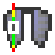
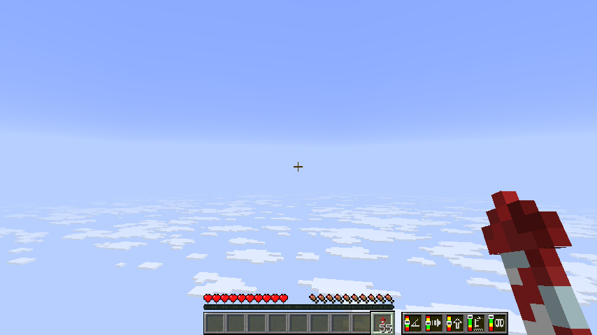
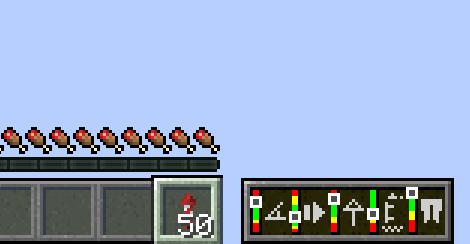
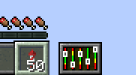

# Elytra Indicators

Elytra Indicators is a Minecraft mod that provides Vanilla-style "fly by instrument" support for elytra flight.

When using an elytra in Vanilla Minecraft, it can be difficult to judge how well you're flying. Especially when traveling at high altitudes and speeds and chunk loading struggles to keep up, or when flying over the void in the End, it can be hard to tell whether you're flying at a safe pitch — let alone an optimal one. You can press F3 and stare at the debug screen, but that's not very convenient, and the numbers can be hard to interpret. This mod solves that problem by giving you a set of gauges that show how your flight is going. The gauges are designed to fit in with the Vanilla style and are slightly inspired by those found in real aircraft.

## Gauges

The Elytra Indicators mod adds five gauges to the screen when you're flying with an elytra. These gauges are designed to help you keep track of your flight and avoid crashing. They show, in order from left to right: pitch, speed, climb rate, height, and elytra wear.

Some of these are more intuitive than others, so it is recommended to read the descriptions below to understand how to use the gauges for optimal elytra flight.

### **Pitch**

The first gauge shows your pitch — that is, the angle at which you're flying relative to the ground. If you turn upwards, your pitch increases. This converts speed into altitude gain, but the steeper you go, the shorter the distance you'll travel. If you go too steep, you risk "stalling" — that is, falling to the ground if you run out of speed, instead of maintaining flight.

If you go below the green bar, you risk crashing into the ground. If you go above it, you risk stalling.

### **Speed**

The second gauge shows your total speed. If you go too slow, you risk crashing into the ground. There’s no real issue with going too fast, but due to how Minecraft’s physics work, it takes disproportionately more rockets to increase your speed the faster you go, so at a certain point, it's not really worth it. You can still increase speed almost without limit by diving.

The green bar shows a recommended speed that is reasonable to maintain for long distances.

### **Climb**

The third gauge shows your climb rate — that is, how fast you're gaining (or more commonly, losing) height. This is essentially your speed along the Y axis. Keeping track of your climb is key to successful elytra flight. If your pitch is either too steep or too low, you will lose height faster than necessary, increasing your rocket usage and crash risk. For long-term flights with minimal rocket use, adjust your angle to maintain good speed while keeping the climb rate as high as possible.

If you're above the green bar, you're flying at such a steep angle that you risk running out of speed and falling rapidly. If you're below the green bar, you're descending at a potentially dangerous rate.

### **Height**

The fourth gauge shows your current height compared to the normal Vanilla world ground level. This is a rough estimate to help you judge whether you're flying high enough to avoid crashing into a mountain or End City. Specifically, it does not look at the actual terrain, but just measures your current Y coordinate.

The green bar shows a recommended height to maintain for long flights. Stay at the upper part of this range if you're flying over mountainous terrain.

### **Wear**

The fifth gauge shows how much durability your elytra has left. This is not a linear scale — it will remain in the green area for a long time and only start moving into the yellow and red bars when your elytra is seriously close to breaking. The gauge will move much faster at that point, so stay alert.

The green bar shows that the elytra still has a fairly safe amount of durability left.

## Configuration

There is a single option to configure the mod: the width of the indicator panel. This can be set to **wide** (the default), **medium**, or **compact**. The **compact** setting does not include icons for the gauges, so it’s only useful if you’ve learned how to read the gauges and want to save screen space.

The configuration screen can be accessed using Mod Menu or Mod Settings. You can also directly edit the configuration file `elytraindicators.json` in the `config` folder of your Minecraft instance.

## Screenshot

This is what it looks like when you're using the mod using the default width setting:

This is how it looks like with medium width:

And this is how it looks like in compact mode:

## Download

You can download the mod from any of these sites:

* [GitHub releases](https://github.com/magicus/ElytraIndicators/releases)

## Installation

Install this as you would any other Fabric mod. (I recommend using [Prism Launcher](https://prismlauncher.org/) as Minecraft launcher for modded Minecraft.)

## Support

Do you have any problems with the mod? Please open an issue here on Github.
