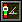
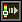
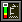
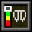

## Gauges

The Elytra Indicators mod adds five gauges to the screen when you are flying with an elytra. These gauges are designed to help you keep track of your flight and avoid crashing. They show, in order from left to right, your pitch, speed, climb rate, height, and elytra wear.

Some of these are more intuitive than others, but it is recommended to read the descriptions below to understand how to use the gauges for optimal elytra flight. 

### **Pitch**

 
The first gauge shows your pitch, that is the angle you are flying at, relative to the ground. If you turn upwards, you will increase your pitch. This will convert your speed into more height gain, but when you go steeper you will travel shorter distances, and if you go too steep, you risk "stalling", that is, fall to the ground if you run out of speed, instead of maintaining flight.

If you go below the green bar, you risk crashing into the ground, and if you go above it, you risk stalling.

### **Speed**

The second gauge shows your total speed. If you go too slow, you risk crashing into the ground. There is really no problem with going too fast, but due to how the physics works in Minecraft, it takes inproportionally more rockets to increase your speed the faster you go, so at a certain point it is not really worth it. You can still increase speed almost without limit by diving.

The green bar shows a recommended speed which is reasonable to maintain for long distances.

### **Climb**

The third gauge shows your climb rate, that is how fast you are gaining (or more commonly, losing) height. This is essentially your speed along the Y axis. Keeping track of your gain is key to successful elytra flight. If your pitch is either too step or too low, you will lose height faster than necessary, and this will increase your use of rockets and risk of crashing. For long-term flights using few rockets, adjust your angle to keep a good speed while still keeping the gain as high as possible.

If you go above the green bar, you are going at such a steep angle that you risk running out of speed and start falling rapidly instad. If you go below the green bar, you are moving closer to the ground at a possibly dangerous speed.

### **Height**

The fourth gauge shows your current height compared to a normal Vanilla world ground level. This is a rough estimate to help you determine if you are flying high enough to not risk crashing into a mountain or End City. Specifically, this does *not* look at the actual terrain, but just measures your current Y coordinate.  

The green bar shows a recommended height to maintain for long flights. Keep at the upper part of this if you are flying over mountaineous terrain.

### **Wear**

The fifth gauge shows how much durability your elytra has left. This is not a linear scale, so it will stay in the green area for a long time, and only start moving into the yellow and red bars when your elytra is seriously about to break. The gauge will move much faster when this happens, so stay alert.

The green bar shows that the elytra has a fairly safe amount of durability left.