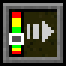

# Elytra Indicators

Elytra Indicators is a Minecraft mod that provides Vanilla-style "fly by instrument" to elytra flight.

When flying with an elytra, especially when travelling high up with high speed, and chunk loading is having a hard time keeping up, or when flying over the void in the End, it can sometimes be hard to tell if you are flying at a safe pitch, let alone if it is an optimal pitch. You can press F3 and stare at the debug screen, but that is not very convenient, and it can be hard to interpret the numbers. This mod solves this problem by giving you a set of gauges, that tells you how you are doing with your elytra flight. The gauges are designed to fit in with the Vanilla HUD, and are slightly inspired by the gauges you would find in a real aircraft.

## Gauges

The Elytra Indicators mod adds five gauges to the screen when you are flying with an elytra. These gauges are designed to help you keep track of your flight and avoid crashing. They show, in order from left to right, your pitch, speed, climb rate, height, and elytra wear.

Some of these are more intuitive than others, but it is recommended to read the descriptions below to understand how to use the gauges for optimal elytra flight.

### **Pitch**

The first gauge shows your pitch — that is, the angle you are flying at relative to the ground. If you turn upwards, you will increase your pitch. This will convert your speed into height gain, but when you go steeper you will travel shorter distances. If you go too steep, you risk "stalling" — that is, falling to the ground if you run out of speed, instead of maintaining flight.

If you go below the green bar, you risk crashing into the ground, and if you go above it, you risk stalling.

### **Speed**

The second gauge shows your total speed. If you go too slow, you risk crashing into the ground. There is no real problem with going too fast, but due to how physics work in Minecraft, it takes disproportionately more rockets to increase your speed the faster you go, so at a certain point it's not really worth it. You can still increase speed almost without limit by diving.

The green bar shows a recommended speed that is reasonable to maintain for long distances.

### **Climb**

The third gauge shows your climb rate — that is, how fast you are gaining (or more commonly, losing) height. This is essentially your speed along the Y axis. Keeping track of your climb is key to successful elytra flight. If your pitch is either too steep or too low, you will lose height faster than necessary, increasing your rocket usage and crash risk. For long-term flights using few rockets, adjust your angle to keep good speed while maintaining as much climb as possible.

If you go above the green bar, you are flying at such a steep angle that you risk running out of speed and falling rapidly instead. If you go below the green bar, you are descending at a possibly dangerous rate.

### **Height**

The fourth gauge shows your current height compared to the normal Vanilla world ground level. This is a rough estimate to help you determine if you are flying high enough to avoid crashing into a mountain or End City. Specifically, this does not look at the actual terrain, but just measures your current Y coordinate.

The green bar shows a recommended height to maintain for long flights. Stay at the upper part of this if you are flying over mountainous terrain.

### **Wear**

The fifth gauge shows how much durability your elytra has left. This is not a linear scale, so it will stay in the green area for a long time, and only start moving into the yellow and red bars when your elytra is seriously close to breaking. The gauge will move much faster at that point, so stay alert.

The green bar shows that the elytra has a fairly safe amount of durability left.

## Configuration

There is a single option to configure the mod: the width of the indicator panel. This can be set to WIDE (the default), MEDIUM and COMPACT. The COMPACT setting does not have any indication what each gauge means, so it is only useful if you have learned how to read the gauges and want to save space.

The configuration screen can be reached using Mod Menu or Mod Settings. You can also directly edit the configuration file `elytraindicators.json` in the `config` folder of your Minecraft instance.

## Screenshot

This is what it looks like when you are using the mod.

## Download

You can download the mod from any of these sites:

* [GitHub releases](https://github.com/magicus/ElytraIndicators/releases)

## Installation

Install this as you would any other Fabric mod. (I recommend using [Prism Launcher](https://prismlauncher.org/) as Minecraft launcher for modded Minecraft.)

## Support

Do you have any problems with the mod? Please open an issue here on Github.
